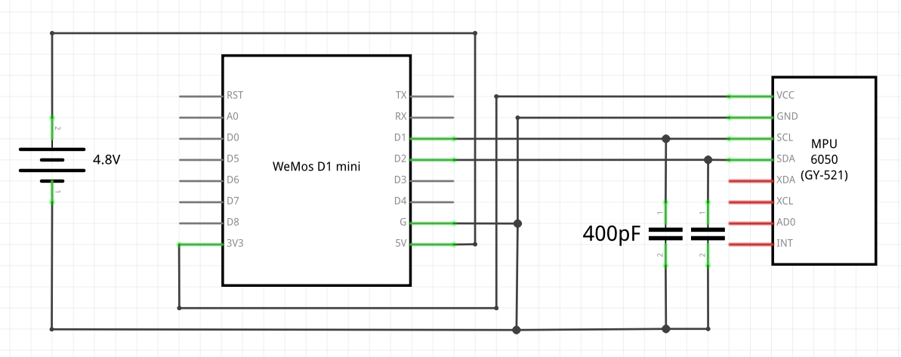

# RC-Car sensor pod

Placing a ESP-based device into an RC-car to provide sensor data.

> If you are trying to implement a user-interface or HTTP webserver in your ESP8266 then you are really abusing its intended purpose. When it comes to scoping your ESP8266 applications, the adage Keep It Simple Stupid truly applies.

Well...

## Feature set

- Wifi-AP 
- read sensor data via I2C
- http-server
- push sensor data via websocket to browser application

## Software

### Prerequisites

1. clone this repo
2. git submodule update --init --recursive
3. Install python-dependency for esptool: `apt-get install python-serial`
4. Add yourself to dialout usergroup (login afterwards to activate): `sudo usermod -a -G dialout $USER`

### Install ESP-firmware

1. go to [nodemcu-build.com](https://nodemcu-build.com/) 
2. and create an image with the following modules: 
`bit crypto encoder file gpio i2c mdns net node rtctime sjson sntp struct tmr uart websocket wifi`
3. Wait for notification e-mail and download the images with the links provided. 
4. Erase flash. Only needed once before first flash: 
```
$ ./esptool/esptool.py erase_flash
    esptool.py v2.5.1-dev
    Found 2 serial ports
    Serial port /dev/ttyUSB0
    Connecting....
    Detecting chip type... ESP8266
    Chip is ESP8266EX
    Features: WiFi
    MAC: a0:20:a6:10:39:94
    Uploading stub...
    Running stub...
    Stub running...
    Erasing flash (this may take a while)...
    Chip erase completed successfully in 9.2s
    Hard resetting via RTS pin...

```
5. Flash image: 
```
$ ./esptool/esptool.py write_flash 0x00000 rc-car/image/nodemcu-master-23-modules-2018-09-23-09-01-43-float.bin 
    esptool.py v2.5.1-dev
    Found 2 serial ports
    Serial port /dev/ttyUSB0
    Connecting....
    Detecting chip type... ESP8266
    Chip is ESP8266EX
    Features: WiFi
    MAC: 01:02:03:04:05:06
    Uploading stub...
    Running stub...
    Stub running...
    Configuring flash size...
    Auto-detected Flash size: 4MB
    Flash params set to 0x0240
    Compressed 950272 bytes to 656268...
    Wrote 950272 bytes (656268 compressed) at 0x00000000 in 57.6 seconds (effective 131.9 kbit/s)...
    Hash of data verified.

    Leaving...
    Hard resetting via RTS pin...
```
6. Check with: `./uploader/nodemcu-uploader.py terminal` (press reset-button to reboot nodemcu)

```
--- Miniterm on /dev/ttyUSB0  115200,8,N,1 ---
--- Quit: Ctrl+] | Menu: Ctrl+T | Help: Ctrl+T followed by Ctrl+H ---

NodeMCU custom build by frightanic.com
	branch: master
	commit: 3661b8d5eb5b42ed2d5ff51fa8e9628c17270973
	SSL: false
	modules: adc,bit,crypto,dht,encoder,enduser_setup,file,gpio,http,mqtt,net,node,perf,pwm,sjson,sntp,spi,sqlite3,struct,tmr,uart,websocket,wifi
 build created on 2018-09-23 09:00
 powered by Lua 5.1.4 on SDK 2.2.1(6ab97e9)
lua: cannot open init.lua

```

### Download files

Go to folder: `cd rc-car`

#### via ESPlorer GUI

`sudo java -jar ../ESPlorer/ESPlorer.jar`

#### via Command line

Run `./deploy.sh` or modify `deploy.sh` as you apply changes. 

- Remove files: `../uploader/nodemcu-uploader.py file remove init.lua config.lua flashdaemon.lua`
- Terminal: `../uploader/nodemcu-uploader.py terminal`

## Hardware




### Pinning WEMOS D1 Mini

Pin	| Function	| ESP-8266 Pin
--|--|--
TX|	TXD|	TXD
RX|	RXD|	RXD
A0|	Analog input, max 3.3V input	|A0
D0|	IO|	GPIO16
`D1`|	IO, `SCL`	|`GPIO5`
`D2`|	IO, `SDA`	|`GPIO4`
D3|	IO, 10k Pull-up	|GPIO0
D4|	IO, 10k Pull-up, BUILTIN_LED	|GPIO2
D5|	IO, SCK	|GPIO14
D6|	IO, MISO	|GPIO12
D7|	IO, MOSI	|GPIO13
D8|	IO, 10k Pull-down, SS	|GPIO15
`G`	|`Ground`|	`GND`
`5V`|	`5V`|	-
`3V3`|	`3.3V`|	`3.3V`
RST|	Reset|	RST
`used pins`

### Pinning GY-521 MCU-6050


## References

- https://nodemcu.readthedocs.io/en/master/
- https://frightanic.com/iot/comparison-of-esp8266-nodemcu-development-boards/
- https://nodemcu-build.com/
- https://playground.arduino.cc/Main/MPU-6050
- https://www.invensense.com/products/motion-tracking/6-axis/mpu-6050/
- https://www.i2cdevlib.com/devices/mpu6050#source
- https://github.com/marcoskirsch/nodemcu-httpserver
- https://tools.ietf.org/html/rfc6455
