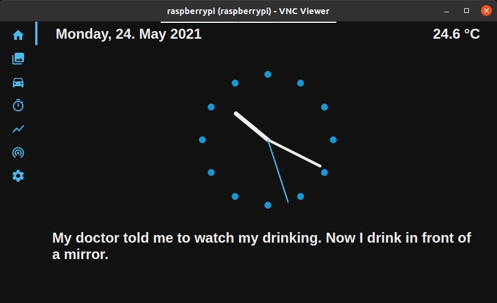

# Introduction



# Hardware

## Parts

- [Raspberry Pi 4 Computer Modell B, 4GB RAM](https://www.berrybase.de/raspberry-pi/raspberry-pi-computer/boards/raspberry-pi-4-computer-modell-b-4gb-ram?c=319)
- [Geekworm Raspberry Pi 4 Aluminum Case](https://www.amazon.de/Geekworm-Raspberry-Aluminum-Passive-Dissaption/dp/B07ZVJDRF3)
- [LABISTS Raspberry Pi 4 Type C 5.1V 3A](https://www.amazon.de/LABISTS-Raspberry-Type-C-Kabel-Schwarz/dp/B07ZCK2B8J)
- [5 Zoll kapazitiver Touchscreen für Raspberry Pi](https://www.amazon.de/kapazitiver-Touchscreen-Raspberry-4-800x480-Unterstützung/dp/B07ZD4QGQJ)
- [GY-BME280 Breakout Board](https://www.berrybase.de/sensoren-module/feuchtigkeit/gy-bme280-breakout-board-3in1-sensor-f-252-r-temperatur-luftfeuchtigkeit-und-luftdruck?c=92)
- [40pin Jumper](https://www.berrybase.de/raspberry-pi/raspberry-pi-computer/kabel-adapter/gpio-csi-dsi-kabel/40pin-jumper/dupont-kabel-female-150-female-trennbar)

## Setup

Connect either BME280 or BMP180. E-Version is with humidity sensor and 280 is the next-gen 180 with better performance.


# Software
## Operating System

1. Use the [Raspberry Pi Imager](https://www.raspberrypi.org/software/) to install `Raspberry Pi OS with desktop`.
2. Alternative: download [Raspberry Pi OS with desktop](https://www.raspberrypi.org/software/operating-systems/) and flash to disk (use [Startup Disc Creator](https://help.ubuntu.com/stable/ubuntu-help/addremove-creator.html) or `sudo dd if=2021-03-04-raspios-buster-armhf.img of=/dev/sdx bs=4M`, make sure to use the correct device)
3. `sudo raspi-config`: 
- `Interface Options` -> enable `P3 VNC` and `P5 I2C`
- `Display Options` -> `Resolution` -> `Mode 9 (800x600)`
4. update software packages: `sudo apt update && sudo apt upgrade -y`
5. reboot: `sudo rebooot now`

## User Interface

1. [Install Node-RED](https://nodered.org/docs/getting-started/raspberrypi)
2. Install mosquitto MQTT Broker: 
 - `sudo apt-get install mosquitto mosquitto-clients`
 - Test with: `mosquitto_sub -h localhost -t \$SYS/broker/bytes/#`
3. Open node-red in a browser (`http://raspberrypi:1880/`) and import `flows.json`.

## Kiosk Mode

`sudo apt install unclutter`

`nano /home/pi/kiosk.sh`
```sh
#!/bin/bash
#xset s noblank
#xset s off
#xset -dpms

#unclutter -idle 0.5 -root &

sed -i 's/"exited_cleanly":false/"exited_cleanly":true/' /home/pi/.config/chromium/Default/Preferences
sed -i 's/"exit_type":"Crashed"/"exit_type":"Normal"/' /home/pi/.config/chromium/Default/Preferences
#/usr/bin/chromium-browser --noerrdialogs --disable-infobars --kiosk http://localhost:1880/ui &
/usr/bin/chromium-browser --noerrdialogs --disable-infobars --kiosk --enable-logging=stderr http://localhost:1880/ui &

while true; do
      sleep 1
done
```
Make it executable: `chmod +x /home/pi/kiosk.sh`

run `echo $DISPLAY` from a GUI-shell (NOT ssh-session) and use the result in the following file:

`sudo nano /etc/systemd/system/kiosk.service`:
```ini
[Unit]
Description=Chromium_Kiosk
Wants=graphical.target
After=graphical.target

[Service]
Environment=DISPLAY=:0.0
Environment=XAUTHORITY=/home/pi/.Xauthority
Type=simple
ExecStart=/bin/bash /home/pi/kiosk.sh
Restart=on-abort
User=pi
Group=pi

[Install]
WantedBy=graphical.target
```

enable on boot: `sudo systemctl enable kiosk.service` 

start: `sudo systemctl start kiosk.service`
stop: `sudo systemctl stop kiosk.service`

## Application Icon

`sudo nano /usr/share/applications/Dashboard.desktop`

```
[Desktop Entry]
Version=1.0
Exec=sudo systemctl start kiosk
Name=Dashboard
Encoding=UTF-8
Terminal=true
Type=Application
Categories=Application;Network;
Icon=ksysguard
```

The Dashboard can be found in the Internet Section:


## Media Files

Copy all media files (images/videos) to `~/.node-red/lib/ui-media/lib/Videos/` and re-deploy the flow.

## Wireless Access Point

Install packages:

```sh
sudo apt install hostapd dnsmasq -y
sudo systemctl unmask hostapd && sudo systemctl enable hostapd
sudo DEBIAN_FRONTEND=noninteractive apt install -y netfilter-persistent iptables-persistent
```

`sudo nano /etc/dhcpcd.conf`:
```
interface wlan0
    static ip_address=192.168.1.1/24
    nohook wpa_supplicant
```

`sudo nano /etc/sysctl.d/routed-ap.conf`:
```
# https://www.raspberrypi.org/documentation/configuration/wireless/access-point-routed.md
# Enable IPv4 routing
net.ipv4.ip_forward=1
```

Enable routing: `sudo iptables -t nat -A POSTROUTING -o eth0 -j MASQUERADE`

Save settings: `sudo netfilter-persistent save`

`sudo nano /etc/dnsmasq.conf`:
```
interface=wlan0 # Listening interface
dhcp-range=192.168.1.100,192.168.1.200,255.255.255.0,24h
                # Pool of IP addresses served via DHCP
domain=wlan     # Local wireless DNS domain
address=/base.wlan/192.168.1.1
                # Alias for this router
```

`sudo nano /etc/hostapd/hostapd.conf`
```
country_code=DE
interface=wlan0
ssid=Telemetry
hw_mode=g
channel=7
macaddr_acl=0
auth_algs=1
ignore_broadcast_ssid=0
wpa=2
wpa_passphrase=virtualbusadapter
wpa_key_mgmt=WPA-PSK
wpa_pairwise=TKIP
rsn_pairwise=CCMP
```

Reboot to enable: `sudo reboot now`

## Connecting Wifi clients

AP-Name: `Telemetry`

Service | Hostname | IP-Address
---|---|---
mosquitto| base.wlan | 192.168.1.1

Check on connected clients with `iw dev wlan0 station dump` and `cat /var/lib/misc/dnsmasq.leases`.

# Improvements

- Use a [MPU-9250](https://www.amazon.de/MakerHawk-MPU-9250-Modul-Achs-Gyroskop-Beschleunigungsmesser-Magnetfeld-Sensor/dp/B07173R5QC) or similar as motion tracking device. See also: https://github.com/henrythasler/iot/tree/master/sensors/MPU-9250 

# References

- [Raspberry Pi Pinout](https://pinout.xyz/pinout/i2c#)
- [Raspberry Pi Kiosk using Chromium](https://pimylifeup.com/raspberry-pi-kiosk/)
- [Setting up a Raspberry Pi as a routed wireless access point](https://www.raspberrypi.org/documentation/configuration/wireless/access-point-routed.md)
